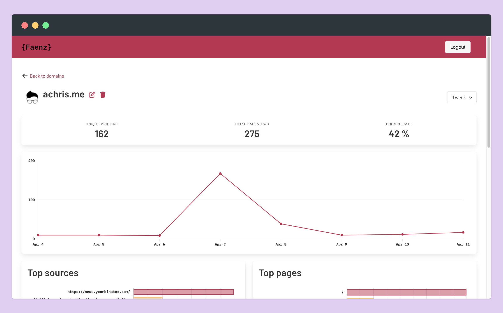
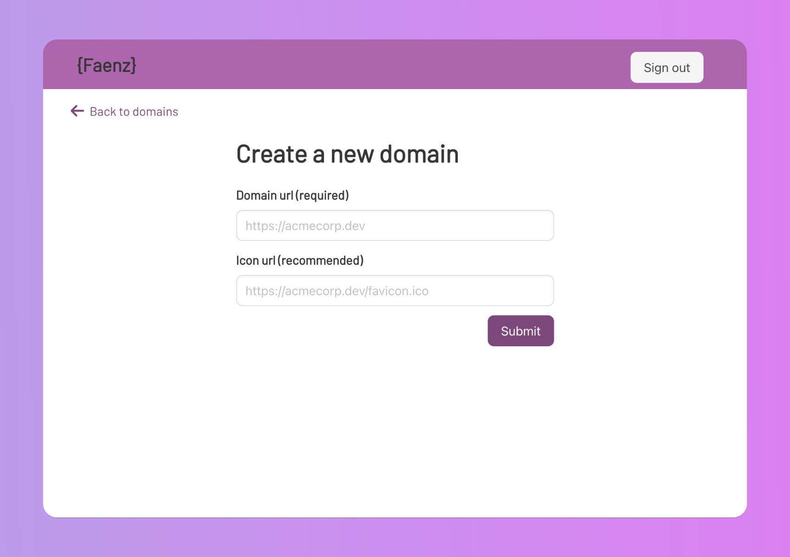

**Faenz is the web analytics for smalls businesses and side projects.**

Faenz is a simple, open source, lightweight and privacy friendly web analytics, like a friendlier cousin to [Plausible](https://plausible.io/). GDPR Compliant. Cookie-free. Hostable on Render or your personal server with Docker images with no extra dependencies.

Crafted with care using Ruby on Rails



# Why

In my quest for a GDPR-compliant analytics tool for my personal website and side projects, I had the opportunity to try the Plausible free-period and it was really good!

At the end of the free-period I wanted to selfhost Plausible but it was too heavy for my trusty VPS with a humble 1 CPU and 1GB of RAM, that I also use for all my databases and personal projects. So I built my own solution using Ruby on Rails to be run on a low capable VPS and even on Render and similar services!

Honestly, I didn't even read the Plausible source code. I just thought I could re-implement most of Plausible features by knowing how it works from the user perspective.

# Data Policy

Faenz only collect essential information:

- **referrer**: the page from which the user is coming from (e.g. google, facebook, twitter, etc..)
- **url**: the url of the page loaded (e.g. https://yoursite.com/home)
- **width**: the width, in pixel, of the device used to load the page (e.g. 1920)
- **user IP Address**: the user IP is needed to calculate some metrics like the bounce rate, but is not used to track the user activity. **The IP address is mixed with a random salt and encrypted. A new salt is generated every 24 hours, so there's no way to know if a user have been visiting your website two days in a row.** We have re-implemented the Plausible algorithm for this, [take a look.](https://plausible.io/data-policy)

# How Faenz works

## Collecting website visits

First of all, you need to host the Faenz instance, sign in to the dashboard and add a new domain by typing its domain and favicon urls.



Then you have to load the Faenz frontend file [Javascript file](https://github.com/a-chris/faenz/blob/main/public/faenz.js) into your website pages, the code will send a HTTP request when the page is loaded on the user's browser so that Faenz can collect the information regarding the visit on your website.

Assuming that you are hosting Faenz on you webserver available at `https://myfaenz.com` and you want to collect analytics data for `https://mywebsite.com` then you need to add this code to your website pages:

```javascript
<script defer data-domain="https://mywebsite.com" src="https://myfaenz.com/faenz.js" />
```

that's all. Go to your Faenz dashboard and enjoy the realtime statistics.

## Server side

You could potentially use Faenz for server-side analytics by sending a POST HTTP request from your server directly to Faenz to collect data regarding user visits, like before, but being sure that every visit is collected and not blocked by an ad-blocker or because the user has turned off Javascript.

I'm planning to support more fields in the future for more advanced use cases.

# How to selfhost/deploy Faenz

You can selfhost Faenz just by using the docker image and running it with the right environment variables. Faenz supports both SQLite and MySQL/MariaDB databases, follow the instructions in the next paragraphs.

## Heroku

We used to support Heroku in previous versions, using MySQL or MariaDB databases. In recent versions we preferred to only keep SQLite because [Heroku can't host a SQLite database](https://devcenter.heroku.com/articles/sqlite3).

## Render

[Render](https://render.com) is an Heroku alternative that I found out only recently but is pretty convenient to deploy Ruby on Rails applications. The setup is very similar to Heroku.
As far as I know, you can host a SQLite database on render only with paid plans because with the free plan you don't get access to the file system so you need to use the MySQL solution to persist your data.

1. Fork this project
2. Add your fork repository to Render and during the setup select:

- **Environment** => **Ruby**
- **Build command** => `./bin/render-build.sh`

3. Setup the required variables:

- BUNDLE_WITHOUT => development:test
- DB => mysql
- ADMIN_USERNAME
- ADMIN_PASSWORD
- DB_HOST
- DB_PORT
- DB_USER
- DB_PSWD
- GEOIP_API_KEY (if you want to geolocate IPs)

4. Deploy on Render

The standard name for the database will be `faenz`, if you want to give a different name you can use the environment variable `DB_NAME`

## Run as a Docker container

Docker images are hosted on a [public DockerHub repository](https://hub.docker.com/repository/docker/achris15/faenz).

By running Faenz with the SQLite database all the data are stored into a sqlite database created inside the docker container. It would be a really good idea to create a volume to persist the database on your file system and not lose it if something goes wrong with the container.
The required variables to use Faenz with SQLite are:

- DB=sqlite
- ADMIN_USERNAME
- ADMIN_PASSWORD
- GEOIP_API_KEY (if you want to geolocate IPs)

e.g.

```bash
docker run -p 3000:3000 -e DB=sqlite -e ADMIN_USERNAME=admin -e ADMIN_PASSWORD=test achris15/faenz:<version>
```

or you can create a `docker-compose.yml` file and run it with **doker-compose**

```
services:
  web:
    image: achris15/faenz:<version>
    ports:
      - "3000:3000"
    environment:
      - DB=sqlite
      - ADMIN_USERNAME=admin
      - ADMIN_PASSWORD=test
      - GEOIP_API_KEY (if you want to geolocate IPs)
    volumes:
      - "./data:/faenz-analytics/sqlite_db"
```

adding a `volume` is recommended to not lose your data after destroying the container or depolying a new version.

# IP Geolocation

Faenz supports IP Geolocation by using the https://ipgeolocation.io API, you can use the free plan that gives 30k requests per month and 1k daily, you just need to signup and save the API key into the environment variable `GEOIP_API_KEY`.

If you have a better solution in mind feel free to open an issue 🙏

# Build the container

Be sure to have all the Ruby dependencies installed with

```bash
bundle install
```
and then:
```bash
yarn install
bundle exec rails assets:precompile
```

and run

```bash
docker build --tag faenz .
```

# TODO

- [x] Release public Docker images
- [x] Make Faenz hostable on [Render](https://render.com)
- [x] Screenshots, presentation and demo of Faenz
- [x] Remove the NodeJS dependency by using a multi-stage Docker build
- [x] Dark theme
- [ ] Generate two docker images: one for SQLite, one for MySQL and include a reverse proxy solution
- [ ] Support import and export of data, making it compatible with Plausible exports
- [ ] Allow collecting extra and complex fields
- [ ] Configurable charts (hide or add some charts)
- [ ] Improve UI, design, fonts, colors

# Contributing

Contributing to Faenz should be fair easy if you know Ruby on Rails. It's a really simple web server with controllers and Rails views. For the charts I've been using the ViewComponent library, to keep each chart logic testable and separated.
